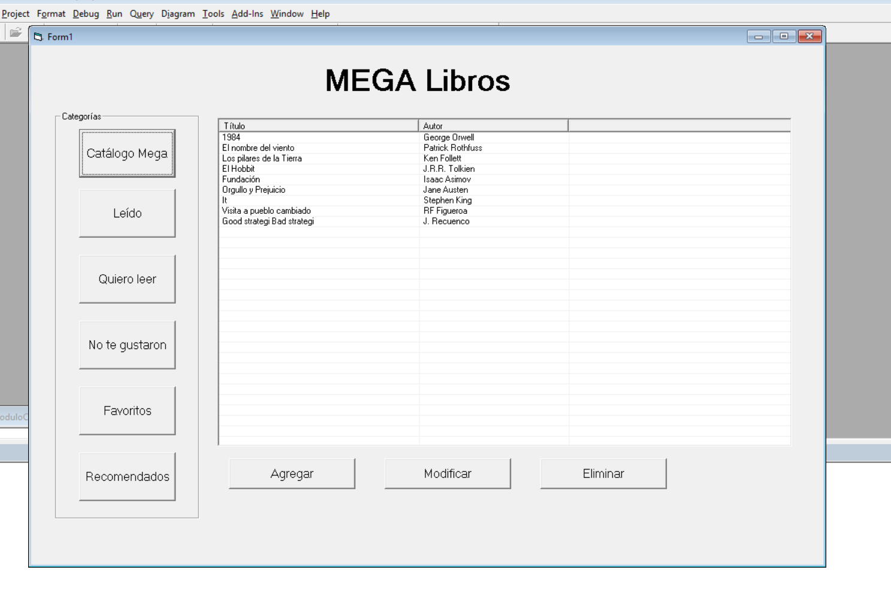
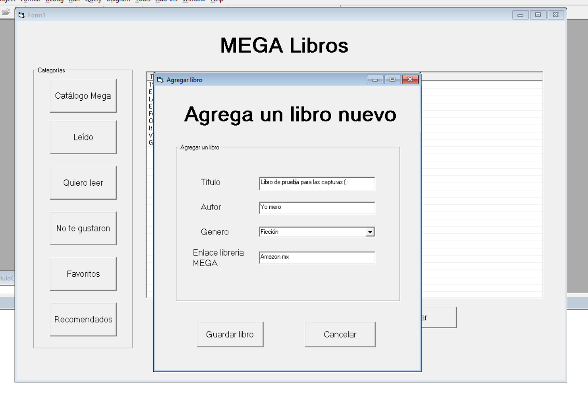
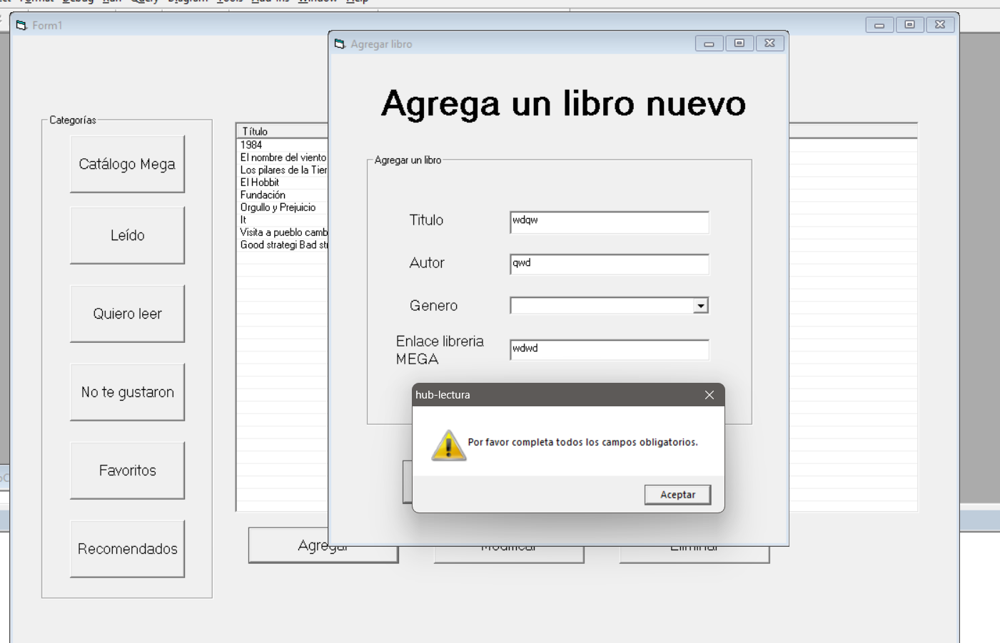
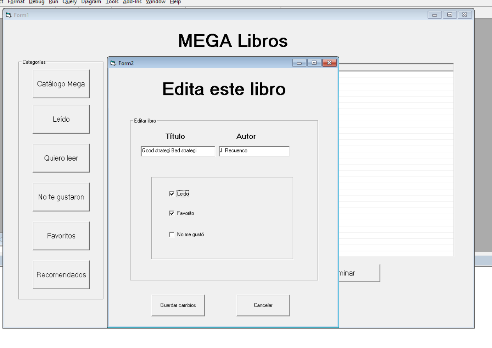
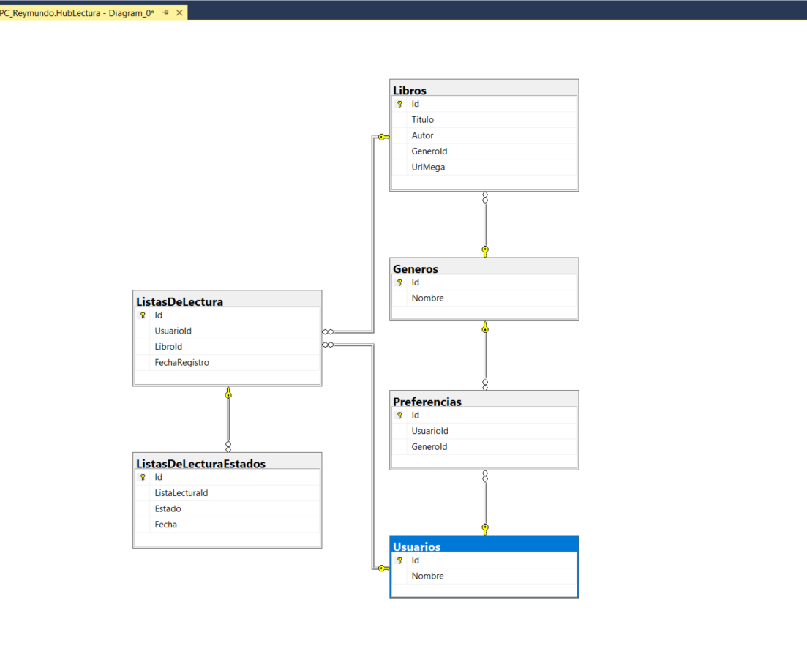

# 📖 Hub de Lectura - Aplicación de Escritorio en Visual Basic 6

---

## 👤 Autor

**Hecho con amor por**: Reymundo Fernando Figueroa Romo  

**Tecnologías utilizadas**:  

- Visual Basic 6 (Interfaz gráfica)  
- SQL Server (Base de datos)  
- ADO (Acceso a datos)

---

## 🖼️ Capturas del Proyecto

Vista del Home. En esta vista puedes ver los libros agregados y filtrarlos por diferentes categorías como:

- Catalogo completo
- Leído
- Quiero leer
- No te gustaron
- Favoritos
- Recomendados

Además de agregar un libro nuevo, editar uno existente o eliminarlo

Vista Agregar libro. En esta vista puedes agregar un libro nuevo al catalogo

También esta misma vista maneja errores para capos faltantes

Vista editar libro. En esta vista se pueden editar los estados del libro como si es favorito o no, incluso sii ya está leído (por defecto todo libro nuevo creado esta como "No leído")

---

## 📖 Diagrama entidad relación 

## 📌 Descripción del Proyecto

El **Hub de Lectura** es una aplicación de escritorio desarrollada en Visual Basic 6 que permite al usuario gestionar su biblioteca personal, conectándose a una base de datos en SQL Server.

### Funcionalidades principales:

- Visualización de un catálogo de libros
- Clasificación de libros según el estado de lectura:
  - Leídos
  - Por leer
  - No me gustaron
  - Favoritos
- Gestión de preferencias por género
- Recomendación de libros basada en géneros favoritos
- Agregar nuevos libros al catálogo
- Editar el estado de lectura de los libros
- Eliminar libros de la base de datos

Se utilizó ADO para la conexión con la base de datos y operaciones CRUD desde la interfaz de usuario. Se implementaron formularios separados para agregar y editar libros, con un enfoque en la mejora de la experiencia de usuario dentro de las limitaciones de VB6.

---

## ⚙️ ¿Cómo se construyó?

1. **Modelado de base de datos** en SQL Server:
   - Diseño relacional con claves foráneas
   - Integridad referencial para estados de lectura y preferencias

2. **Desarrollo de interfaz gráfica** en VB6:
   - Uso de controles `ListView`, `TextBox`, `ComboBox` y `CheckBox`
   - Formularios dedicados para agregar y editar libros

3. **Conexión con base de datos**:
   - Manejo de conexiones ADO
   - Consultas SQL dinámicas según el estado del libro

4. **Separación de funcionalidades**:
   - Uso de módulos para funciones reutilizables
   - Botones con funcionalidades bien definidas para cada acción (leer, editar, eliminar, recomendar, etc.)

---

## 🐞 Problemas conocidos

- El sistema actualmente no soporta múltiples usuarios con login, se asume que solo hay un usuario activo.
- El control `ListView` en VB6 requiere precaución para evitar errores si no se actualiza correctamente el `.Tag` de los ítems.
- No se valida si un mismo libro ya existe al agregar uno nuevo (riesgo de duplicados).
- No hay control de errores visual sofisticado (todo es mediante `MsgBox`).

---

## 🧪 Sprint Review

## 🧪 Sprint Review

| ¿Qué hice bien?                                                                 | ¿Qué no salió bien?                                                                                     | ¿Qué puedo hacer diferente?                                                                                 |
|----------------------------------------------------------------------------------|----------------------------------------------------------------------------------------------------------|-------------------------------------------------------------------------------------------------------------|
| - La maquetación de la interfaz fue sencilla.                                                                         | - La instalación del entorno de VB6 fue complicada debido a temas de compatibilidad.                      | - No usar versiones de Windows que estén en el programa de Windows Insider para mi equipo de trabajo.       |
| - La segmentación de lógica en distintos módulos ayudó a aplicar el principio DRY (Don't Repeat Yourself).           | - No alcancé a integrar la funcionalidad de login y crear cuenta.                                        |                                                                                                             |

---
